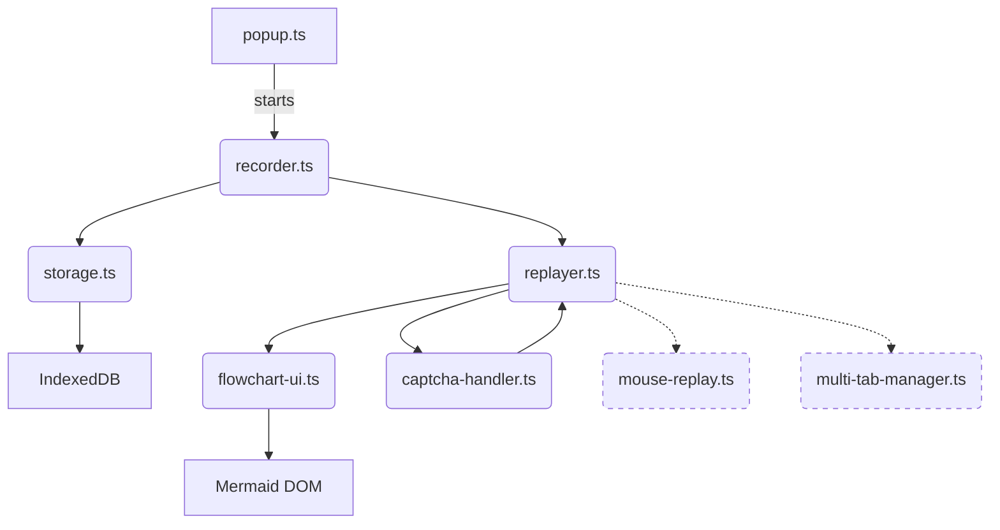

```mermaid
graph TD
  A[popup.ts] -->|starts| B(recorder.ts)
  B --> C(storage.ts)
  C --> D[IndexedDB]
  B --> E(replayer.ts)
  E --> F(flowchart-ui.ts)
  F --> G[Mermaid DOM]
  E --> H(captcha-handler.ts)
  H --> E
  %% FUTURE
  E -.-> I(mouse-replay.ts):::future
  E -.-> J(multi-tab-manager.ts):::future

classDef future stroke-dasharray: 5 5;
```
